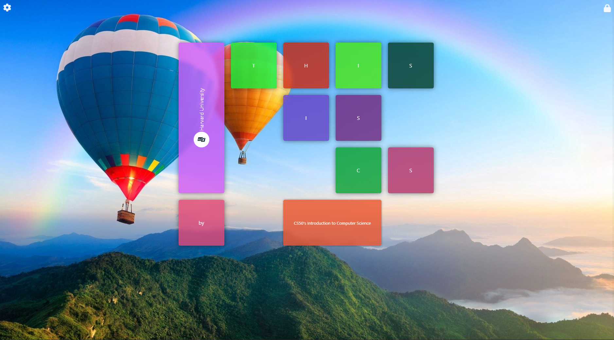
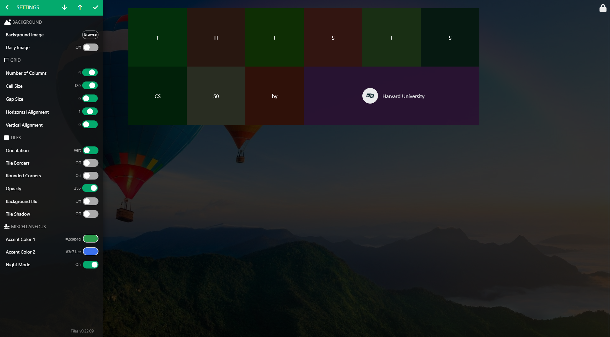

# TILES


#### Описание
---
**Tiles** — это клиентское веб-приложение, которое предоставляет пользователям гибкие и удобные инструменты для создания и управления визуальными вкладками. Приложение позволяет создавать персонализированные панели с плитками и менять их визуальное оформление. Основное преимущество по сравнении со стандартной домашней страницей, это возможность самостоятельно добавлять плитки со ссылками на нужные сайты для быстрого доступа к ним и полностью менять стиль отображения плитки, а также возможность менять размер и сортировку плиток.

Основная цель проекта — предложить пользователю интуитивно понятный интерфейс для управления плитками и их сеткой, что делает его полезным для создания визуально привлекательных и функциональных дашбордов.

Приложение поддерживает сохранение настроек и панели плиток локально, что позволяет пользователю не потерять свои данные и избежать повторной настройки панели.






#### Основные возможности
---
- **Работа с сеткой:**
  - Изменение количества колонок, размера ячеек и отступов в сетке.
  - Возможность горизонтального и вертикального выравнивания плиток внутри сетки
- **Размер и расположение плиток:**
  - Изменение ширины и высоты плиток через интерактивное меню настроек.
  - Изменение позиции и размера плитки в режиме редактирования при помощи функции drag and drop.
  - Вертикальное или горизонтальное выравнивание содержимого плитки
- **Эффекты отображения:**
  - Настройка цвета фона и прозрачности плиток через интерактивное меню настроек.
  - Добавление эффектов закругления углов, тени, размытия фона и границ плиток.
- **Фон:**
  - Возможность загрузки фонового изображения с компьютера.
- **Темная тема:**
  - Возможность переключения в ночной режим.
- **Импорт/Экспорт плиток:**
  - Сохранение плиток в формате .json локально.
  - Загрузка .json файла с плитками.
- **Сохранение настроек:**
  - Настройки сохраняются в локальной базе данных IndexedDB.
  - Плитки сохраняются в локальной базе данных IndexedDB.


#### Установка
---
1. Клонируйте репозиторий:
   ```bash
   git clone https://github.com/reydanprojects/tiles.git
   cd tiles
   ```
2. Откройте файл `home.html` в браузере.


#### Инструкция пользоваталя
---
1. **Добавление плитки:**
   - Перейдите в режим редактирования плиток, нажав кнопку  в правой верхней части экрана.
   - Нажмите кнопку  на главном экране.
   - В появившейся боковой панели введите заголовок плитки, URL адрес, описание, укажите цвет, размеры и т. д.
   - Нажмите кнопку  в правой верхней части боковой панели для добавления плитки на страницу или кнопку  в левой верхней части панели для отмены действия.
   - Нажмите кнопку  в правой верхней части экрана для сохранения изменений.
2. **Редактирование плитки:**
   - Перейдите в режим редактирования плиток, нажав кнопку  в правой верхней части экрана.
   - Наведите указатель мыши и немного задержите его на плитку которую хотите редактировать для появления дополнительной панели.
   - Нажмите кнопку  в верхней левой части плитки.
   - В появившейся боковой панели внесите желаемые изменения: заголовок, описание, размеры, стили оформления и т. д.
   - Нажмите кнопку  в правой верхней части боковой панели для завершения редактирования плитки или кнопку  в левой верхней части панели для отмены действия.
   - Нажмите кнопку  в правой верхней части экрана для сохранения изменений.
3. **Удаление плитки:**
   - Перейдите в режим редактирования плиток, нажав кнопку  в правой верхней части экрана.
   - Наведите указатель мыши и немного задержите его на плитку которую хотите редактировать для появления дополнительной панели.
   - Нажмите кнопку  в верхней правой части плитки.
   - Нажмите кнопку  в правой верхней части экрана для сохранения изменений.
4. **Экспорт плиток:**
   - Перейдите в боковую панель нажав кнопку  в верхней левой части экрана.
   - Нажмите кнопку  В верхней правой части панели.
   - В появившемся диалоговом окне укажите место для сохранения .json файла с плитками и нажмите кнопку "Сохранить".
5. **Импорт плиток:**
   - Перейдите в боковую панель нажав кнопку  в верхней левой части экрана.
   - Нажмите кнопку  В верхней правой части панели.
   - В появившемся диалоговом окне выберите .json файл с плитками для загрузки и нажмите кнопку "Открыть".

#### Демо видео:
---
<iframe width="560" height="315" src="https://www.youtube.com/watch?v=OpcgeqZZmnk" 
        title="Tiles" frameborder="0" allowfullscreen>
</iframe>


#### Структура проекта
---
```plaintext
project/
|
├── home.html               # Главный HTML-файл
├── styles/
│   ├── main.css            # Основные стили проекта
│   ├── fontawesome.min.css # Иконки Font Awesome
│   └── solid.min.css       # Стиль иконок Font Awesome
├── scripts/
│   ├── main.js             # Основной JavaScript-файл
│   ├── dexie.min.js        # Библиотека для работы с локальной базой данных
│   └── color.js            # Библиотека для работы с цветом
├── assets/
│   ├── favicon.ico         # Иконка проекта
│   └── tiles-cs50.json     # Пример плиток для импорта
├── images/
│   └── bg-image.jpg        # Фоновое изображение домашней страницы
├── webfonts/
│   └── fa-solid-900.*      # Шрифты Font Awesome
└── README.md               # Краткое руководство по проекту
```


#### Используемые технологии
---
- **HTML5:** Разметка страницы.
- **CSS3:** Кастомизация интерфейса с использованием переменных и Grid layout.
- **JavaScript (ES6):** Логика взаимодействия и сохранения данных.
- **Dexie.js:** Работа с локальной базой данных `IndexedDB`.
- **Font Awesome:** Иконки кнопок и навигации.


#### Планы по улучшению
---
- Улучшение адаптивности интерфейса для мобильных устройств.
- Работа над поддержкой различными браузерами.
- Исправление известных проблем.


#### Лицензия
---
Данный проект распространяется под лицензией MIT. Подробности см. в файле [LICENSE](./LICENSE).
